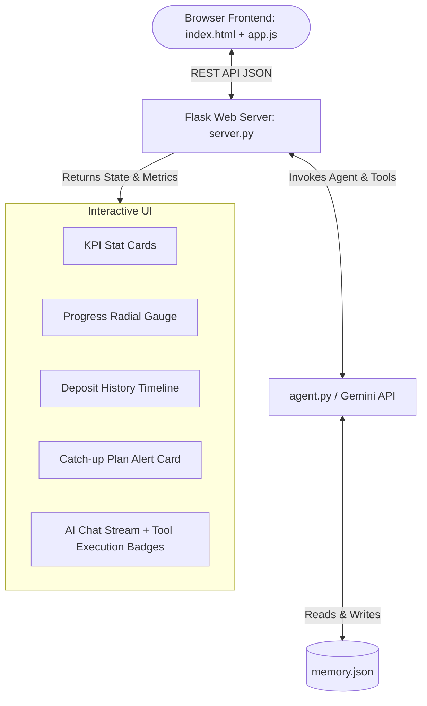

# 💰 Budget Buddy (Gemini AI Savings Agent & Web App)

**Budget Buddy** is an **autonomous AI finance agent** powered by the **Google Gemini API** (`gemini-3.6-flash`) with a modern **Web Dashboard & Interactive AI Chat UI** (built with Vanilla HTML5, CSS3, and JavaScript) to help users track, manage, and achieve financial goals by target dates. 

🚀 **Live Web App**: [https://budget-buddy-gemini.vercel.app](https://budget-buddy-gemini.vercel.app)

---

## 🌟 Key Features

- 🌐 **Interactive Web UI (Dashboard + AI Chat)**  
  Sleek split-screen web application featuring real-time KPI stat cards, an animated progress radial gauge, interactive deposit history timeline, tool execution badges (`⚡ Executed: log_saving → check_progress → get_catchup_plan`), and quick action modals.
- 🤖 **Autonomous Tool Chaining (Plan-Act-Observe Loop)**  
  When a user logs a saving deposit, the agent doesn't just record it—it automatically checks goal progress. If it detects the user has fallen behind schedule, it autonomously generates a tailored catch-up plan before responding.
- 💾 **Persistent Memory Across Runs**  
  Uses a local `memory.json` store to retain target amounts, deadlines, total savings, and transaction history across application restarts.
- 📊 **Intelligent Pace & Shortfall Calculation**  
  Calculates elapsed time vs. remaining time, expected linear savings by date, current shortfall, and revised monthly targets.
- 🚀 **Accelerated Sprint & Catch-Up Plans**  
  Provides both standard monthly catch-up options and intensive 3-month accelerated sprint recommendations when savings fall behind pace.
- 🇮🇳 **Rupee Currency Integration (`₹`)**  
  Formats and displays all financial outputs in Indian Rupees (`₹`).

---

## 🛠️ Tech Stack & Requirements

| Component | Technology / Library | Purpose |
| :--- | :--- | :--- |
| **Frontend UI** | HTML5, Vanilla CSS3, JavaScript (ES6) | Responsive web dashboard, glassmorphism design, chat stream |
| **Web Server API** | Python Flask (`server.py`), `flask-cors` | REST API endpoints & static asset serving |
| **Language** | Python 3.10+ | Core application & agent logic |
| **LLM Engine** | Google Gemini (`gemini-3.6-flash`) | Natural language reasoning & automatic function calling |
| **AI SDK** | `google-generativeai` (>=0.8.3) | Interfacing with Gemini API |
| **Environment** | `python-dotenv` (>=1.0.1) | Secure management of API keys via `.env` |
| **Storage** | Local JSON File (`memory.json`) | Persistent key-value & historical log storage |

---

## ⚙️ Web Application Architecture



---

## 🚀 Setup & Launch Guide

### 1. Prerequisites
- Python 3.10 or higher installed.
- A **Gemini API Key** from [Google AI Studio](https://aistudio.google.com/apikey).

### 2. Install Dependencies
```bash
pip install -r requirements.txt
```

### 3. Configure API Key
Create or edit the `.env` file in the root folder and add your Gemini API key:
```env
GEMINI_API_KEY="your_gemini_api_key_here"
```

### 4. Launch the Web Application
Start the Flask web server:
```bash
python server.py
```
Open your browser and navigate to:
👉 **`http://localhost:5000`**

*(Note: You can also still run the CLI version anytime via `python agent.py`)*

---

## 🧰 Available Agent Tools (`agent.py`)

1. `set_goal(amount: float, months: int) -> dict`  
   - Initializes a new financial target. Calculates end deadline date (assuming 30 days/month) and required average monthly savings.
2. `log_saving(amount: float) -> dict`  
   - Records a new deposit. Updates `saved_total`, appends to historical log with timestamp, and updates remaining balance.
3. `check_progress() -> dict`  
   - Computes elapsed time vs. deadline, expected target balance to date, remaining shortfall, and boolean `on_track` flag.
4. `get_catchup_plan() -> dict`  
   - Triggered when behind schedule. Calculates revised monthly saving goals and accelerated 3-month sprint plans.

---

## 📁 Project Structure

```
.
├── server.py         # Flask REST API server & static file host
├── agent.py          # Gemini AI agent setup, tools, and memory persistence logic
├── index.html        # Single-page web dashboard & chat interface HTML5 markup
├── index.css         # Modern glassmorphism CSS3 styling & responsive grid
├── app.js            # Frontend JavaScript powering live state syncing & chat UI
├── memory.json       # JSON database for persisting goal & transaction history
├── requirements.txt  # Project dependencies
├── .env              # Environment file containing GEMINI_API_KEY
└── README.md         # Comprehensive project documentation
```

---

## ⌨️ API Endpoints Reference

- `GET /api/state`: Returns current state (`goal_amount`, `saved_total`, `deadline_date`, `history`, computed `progress`, and `catchup` plan).
- `POST /api/chat`: Accepts `{ "message": str }`, executes Gemini agent tool-calling loop, updates state, and returns response text & tools executed.
- `POST /api/deposit`: Direct action endpoint to log a deposit `{ "amount": float }`.
- `POST /api/goal`: Direct action endpoint to set a goal `{ "amount": float, "months": int }`.
- `POST /api/reset`: Wipes `memory.json` state and re-initializes Gemini chat session.

